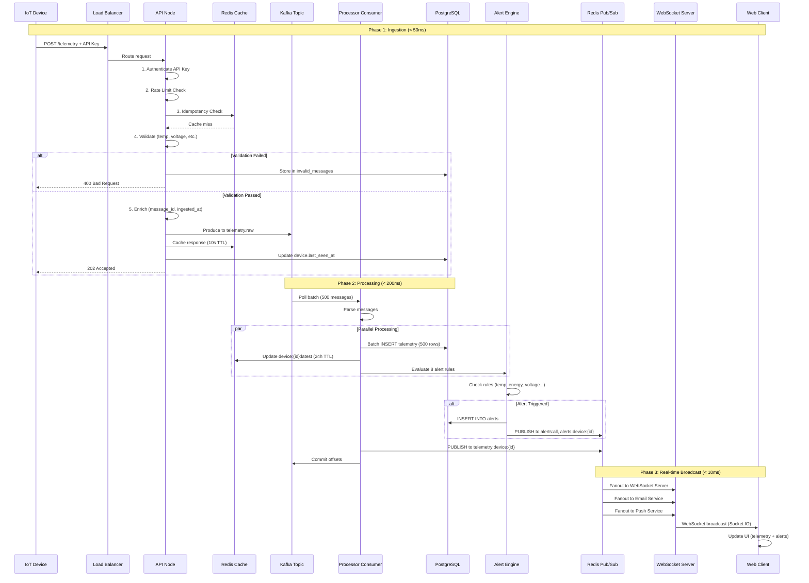
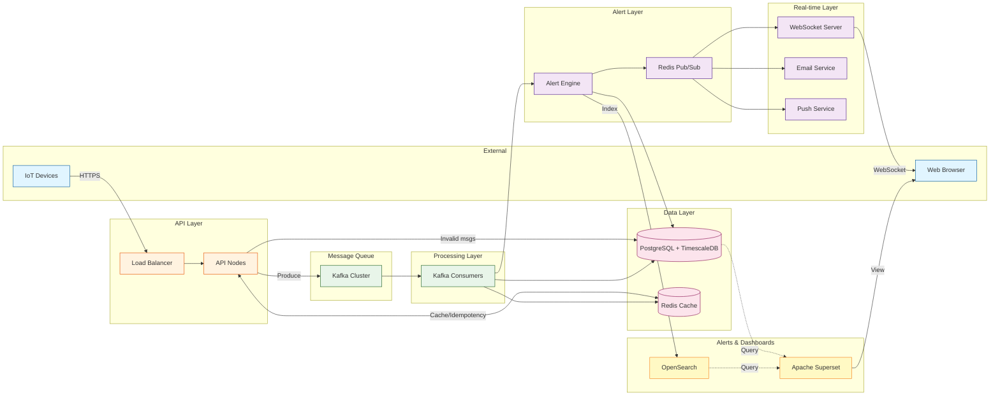
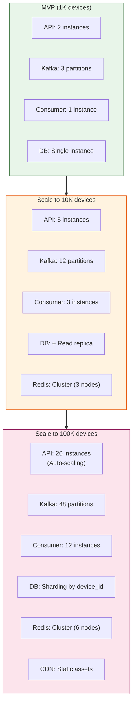
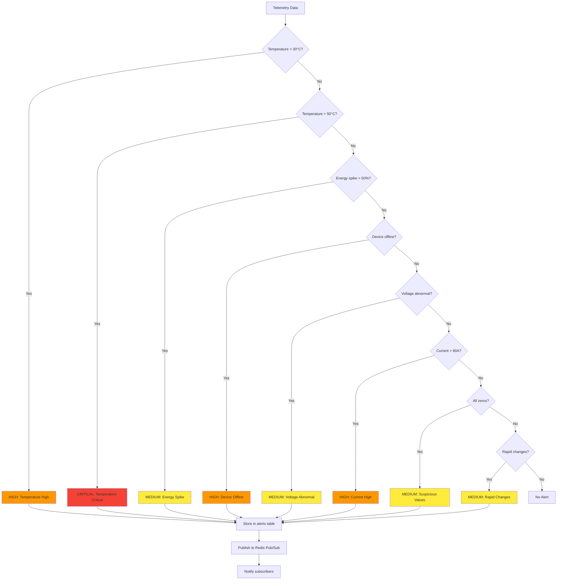
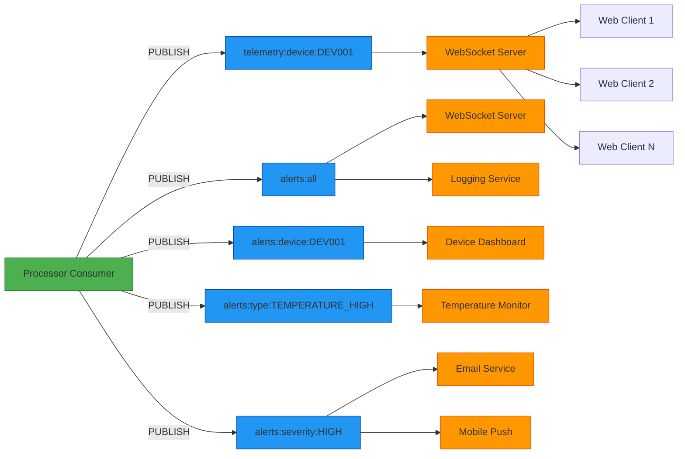

# IoT Telemetry System - Mermaid Architecture Diagram

## Complete System Architecture

```mermaid
graph TB
    subgraph DEVICE_LAYER["🌐 DEVICE LAYER"]
        DEV1["IoT Device DEV001<br/>• Sensors<br/>• API Key<br/>• 60s Heartbeat"]
        DEV2["IoT Device DEV002<br/>• Sensors<br/>• API Key<br/>• 60s Heartbeat"]
        DEV3["IoT Device DEV003<br/>• Sensors<br/>• API Key<br/>• 60s Heartbeat"]
        DEVN["... (1000s devices)"]
    end

    subgraph API_GATEWAY["⚡ API GATEWAY LAYER"]
        LB["Load Balancer<br/>(Nginx - IPv4)<br/>• Round Robin<br/>• Health Checks<br/>• SSL Termination"]
        
        subgraph API_NODES["API Nodes (NestJS)"]
            API1["API Node 1<br/>Endpoints:<br/>• POST /telemetry<br/>• GET /devices/:id/latest<br/>• GET /alerts<br/>• POST /devices<br/>• GET /health"]
            API2["API Node 2<br/>Endpoints:<br/>• POST /telemetry<br/>• GET /devices/:id/latest<br/>• GET /alerts<br/>• POST /devices<br/>• GET /health"]
            APIN["API Node N<br/>Endpoints:<br/>• POST /telemetry<br/>• GET /devices/:id/latest<br/>• GET /alerts<br/>• POST /devices<br/>• GET /health"]
        end
    end

    subgraph API_PROCESSING["🔄 API PROCESSING PIPELINE"]
        AUTH["Step 1: AUTHENTICATION<br/>• Validate API Key<br/>• Check device exists<br/>• Return 401 if invalid"]
        IDEMP["Step 2: REDIS IDEMPOTENCY<br/>• Key: idempotency:{device_id}<br/>• TTL: 10 seconds<br/>• Return cached if exists"]
        VALID["Step 3: VALIDATION<br/>• device_id: Required<br/>• temperature: 0-60°C<br/>• voltage: 0-500V<br/>• current: 0-100A<br/>• timestamp: Not future, max 5min late<br/>• energy_kwh: >= 0"]
        ENRICH["Step 4: ENRICH & PRODUCE<br/>• Generate message_id (UUID)<br/>• Add ingested_at<br/>• Update device.last_seen_at<br/>• Produce to Kafka"]
    end

    INVALID_DB[("PostgreSQL<br/>invalid_messages<br/>• message_id<br/>• device_id<br/>• telemetry_message<br/>• reason_for_failure<br/>• rejected_at")]

    subgraph KAFKA_CLUSTER["📨 KAFKA CLUSTER"]
        PRODUCER["Kafka Producer<br/>Config:<br/>• acks: -1<br/>• retries: 5<br/>• retry.backoff: exponential<br/>• compression: snappy<br/>• batch.size: 16KB<br/>• linger.ms: 10ms"]
        
        subgraph TOPIC["Topic: telemetry.raw"]
            P0["Partition 0<br/>DEV001, DEV004..."]
            P1["Partition 1<br/>DEV002, DEV005..."]
            P2["Partition 2<br/>DEV003, DEV006..."]
        end
        
        TOPIC_CONFIG["Config:<br/>• Partitions: 3→12→48<br/>• Replication: 3<br/>• Retention: 7 days<br/>• min.insync.replicas: 2<br/>• Partition Key: device_id"]
        
        subgraph CONSUMER_GROUP["Consumer Group: telemetry-processors"]
            C1["Consumer 1<br/>(Partition 0)"]
            C2["Consumer 2<br/>(Partition 1)"]
            CN["Consumer N<br/>(Partition 2)"]
        end
        
        CONSUMER_CONFIG["Config:<br/>• Batch: 500 messages<br/>• autoCommit: false<br/>• Retry: 3 attempts<br/>• Circuit breaker: 5 failures"]
    end

    subgraph PROCESSING["⚙️ PROCESSING & STORAGE LAYER"]
        PROC_CONSUMER["Processor Consumer<br/>For each batch (500 msgs):<br/>1. Parse messages<br/>2. Batch INSERT to DB<br/>3. Evaluate alert rules<br/>4. Store alerts in DB<br/>5. Publish to Redis Pub/Sub<br/>6. Commit Kafka offsets"]
        
        subgraph STORAGE["Storage Components"]
            DB[("PostgreSQL + TimescaleDB<br/>Tables:<br/>1. devices<br/>2. telemetry (hypertable)<br/>3. alerts<br/>4. invalid_messages<br/><br/>UNIQUE: (device_id, timestamp, message_id)<br/>Scaling: Read replicas, Sharding, Compression (90%)")]
            
            REDIS_CACHE[("Redis<br/>Keys:<br/>• idempotency:{id} (TTL: 10s)<br/><br/>Performance:<br/>• GET: < 1ms<br/>• SET: < 1ms")]
            
            ALERT_ENGINE["Alert Engine<br/>Rules:<br/>1. Temp > 30°C (HIGH)<br/>2. Temp > 50°C (CRITICAL)<br/>3. Energy spike > 50% (MEDIUM)<br/>4. Device offline (HIGH)<br/>5. Voltage abnormal (MEDIUM)<br/>6. Current > 80A (HIGH)<br/>7. All zeros (MEDIUM)<br/>8. Rapid changes (MEDIUM)<br/><br/>Output:<br/>• Store in alerts table<br/>• Publish to Redis Pub/Sub"]
        end
    end

    subgraph REALTIME["🔴 REAL-TIME BROADCAST LAYER"]
        PUBSUB["Redis Pub/Sub (FANOUT)<br/>Channels:<br/>• telemetry:device:{id}<br/>• alerts:all<br/>• alerts:device:{id}<br/>• alerts:type:{type}<br/>• alerts:severity:{level}<br/><br/>Fanout: 1 PUBLISH → Multiple Subscribers"]
        
        subgraph SUBSCRIBERS["Subscribers"]
            WS["WebSocket Server (NestJS)<br/>Subscribes to:<br/>• telemetry:device:{id}<br/>• alerts:all<br/><br/>Broadcasts to:<br/>• Web clients (Socket.IO)"]
            EMAIL["Email Service<br/>Subscribes to:<br/>• alerts:severity:CRITICAL<br/>• alerts:severity:HIGH<br/><br/>Sends email to:<br/>• admin@..."]
            PUSH["Mobile Push Service<br/>Subscribes to:<br/>• alerts:severity:CRITICAL<br/><br/>Sends push to:<br/>• Mobile apps"]
        end
    end

    WEB["🌍 Web Clients (Browser)<br/>• Dashboard<br/>• Real-time telemetry<br/>• Real-time alerts<br/>• Device status"]

    subgraph ALERTS_DASHBOARD["📊 ALERTS & DASHBOARDS"]
        OPENSEARCH["OpenSearch<br/>(Alerts Storage)<br/>Index: iot-alerts<br/>• Search alerts<br/>• Aggregations<br/>• Time queries"]
        SUPERSET["Apache Superset<br/>(Dashboards)<br/>• Device Overview<br/>• Telemetry Charts<br/>• Alerts Dashboard<br/><br/>Data Sources:<br/>• PostgreSQL<br/>• OpenSearch"]
        HEALTH["Health Checks<br/>GET /health<br/>• Database: up/down<br/>• Redis: up/down<br/>• Kafka: up/down"]
    end

    subgraph OFFLINE_DETECTION["⏰ OFFLINE DEVICE DETECTION"]
        CRON["Cron Job (Every 1 min)<br/>Check: last_seen_at < NOW() - 5min<br/>Action:<br/>1. UPDATE devices SET status='offline'<br/>2. INSERT INTO alerts<br/>3. PUBLISH to Redis Pub/Sub"]
    end

    %% Device Layer Connections
    DEV1 & DEV2 & DEV3 & DEVN -->|"HTTPS POST /telemetry<br/>Headers: X-API-Key<br/>Body: {device_id, temp, voltage...}"| LB

    %% API Gateway Connections
    LB --> API1 & API2 & APIN

    %% API Processing Pipeline
    API1 & API2 & APIN --> AUTH
    AUTH --> IDEMP
    IDEMP --> VALID
    VALID -->|"PASSED"| ENRICH
    VALID -->|"FAILED"| INVALID_DB

    %% Kafka Connections
    ENRICH --> PRODUCER
    PRODUCER --> P0 & P1 & P2
    P0 --> C1
    P1 --> C2
    P2 --> CN

    %% Processing Connections
    C1 & C2 & CN --> PROC_CONSUMER
    PROC_CONSUMER --> DB
    PROC_CONSUMER --> ALERT_ENGINE
    ALERT_ENGINE --> DB
    ALERT_ENGINE --> PUBSUB

    %% Real-time Broadcast
    PUBSUB --> WS & EMAIL & PUSH
    WS --> WEB

    %% Alerts & Dashboards
    ALERT_ENGINE -->|"index alerts"| OPENSEARCH
    DB -.->|"query telemetry"| SUPERSET
    OPENSEARCH -.->|"query alerts"| SUPERSET

    %% Offline Detection
    CRON -.->|"checks"| DB
    CRON -.->|"publishes"| PUBSUB

    %% Styling
    classDef deviceClass fill:#e1f5ff,stroke:#01579b,stroke-width:2px
    classDef apiClass fill:#fff3e0,stroke:#e65100,stroke-width:2px
    classDef kafkaClass fill:#e8f5e9,stroke:#1b5e20,stroke-width:2px
    classDef storageClass fill:#fce4ec,stroke:#880e4f,stroke-width:2px
    classDef realtimeClass fill:#f3e5f5,stroke:#4a148c,stroke-width:2px
    classDef monitorClass fill:#fff9c4,stroke:#f57f17,stroke-width:2px

    class DEV1,DEV2,DEV3,DEVN deviceClass
    class LB,API1,API2,APIN,AUTH,RATE,IDEMP,VALID,ENRICH apiClass
    class PRODUCER,P0,P1,P2,C1,C2,CN kafkaClass
    class DB,REDIS_CACHE,ALERT_ENGINE,INVALID_DB storageClass
    class PUBSUB,WS,EMAIL,PUSH,WEB realtimeClass
    class OPENSEARCH,SUPERSET,HEALTH,CRON monitorClass
```

---

## Simplified Data Flow Diagram

---

## Component Interaction Diagram

---

## Scaling Strategy Diagram

---

## Alert Rules Flow

---

## Redis Pub/Sub Fanout

---

### **Key Components (Easy to Explain)**

1. **Load Balancer (Nginx - IPv4)**
   - Simple round-robin load balancing
   - SSL termination
   - Health checks

2. **API Layer (NestJS)**
   - Authentication, validation, idempotency
   - Produces to Kafka

3. **Kafka (Message Queue)**
   - 3 partitions for scalability
   - Reliable message delivery

4. **Processor Consumer**
   - Reads from Kafka
   - Stores in PostgreSQL
   - Evaluates alerts
   - Publishes to Redis Pub/Sub

5. **PostgreSQL + TimescaleDB**
   - Stores telemetry and alerts
   - Time-series optimized

6. **Redis**
   - Idempotency (10s TTL) - API layer
   - Pub/Sub (real-time broadcast)

7. **OpenSearch (Alerts Only)**
   - Stores alerts for search and analysis
   - Easy to query by device, severity, time

8. **Apache Superset (Dashboards)**
   - Connects to PostgreSQL (telemetry)
   - Connects to OpenSearch (alerts)
   - Creates charts and dashboards

9. **WebSocket Server**
   - Subscribes to Redis Pub/Sub
   - Broadcasts to web clients
